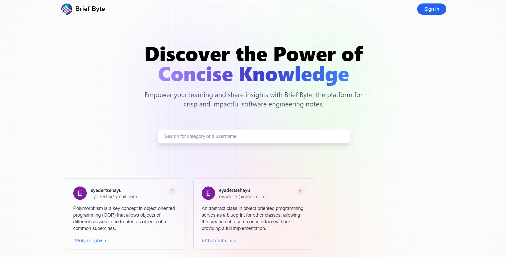

# Breif Byte

### Discover the Power of Concise Knowledge

Breif Byte empowers your learning and share insights with Brief Byte, the platform for crisp and impactful software engineering notes.

## Screenshots 📷

&nbsp;&nbsp;&nbsp;

## Technologies ⚛️

- `Next js`
- `Next Auth`
- `Tailwind CSS`
- `Mongo DB`

## Features

- **User Authentication with Next Auth:** Securely log in and manage your notes.

- **Explore and Discover notes:** Browse a vast library of notes to find helping notes.

## Feedback

I welcome your feedback! If you have any suggestions, issues, or feature requests, please open an issue on our [GitHub repository](https://github.com/EyaderTsehayu/Habeshan-Pod/issues).

## License

This project is licensed under the [MIT License](LICENSE).

## Author 📝

- Eyader Tsehayu(eyaderts@gmail.com)

---
